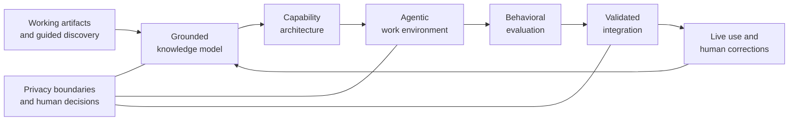

# Harness Engine

> A private agentic systems platform that turns real work, domain knowledge, and operating judgment into grounded AI work environments.

**Selected project · Agent systems · Context engineering · AI integration**

This repository is a public technical overview of a private system. It describes the architecture, engineering decisions, and areas of ownership without publishing the engine, its prompts, client material, or deployment logic.

## Why I built it

Most AI assistants are configured with a short prompt and expected to infer the rest. That works for generic tasks, but it breaks down when useful performance depends on undocumented judgment: exceptions, failure modes, organizational context, handoffs, and the reasoning behind how work is actually done.

Harness Engine treats personalization as a systems-engineering problem. It grounds an AI environment in evidence from real work, turns that evidence into durable structured knowledge, composes the right mix of agentic capabilities, verifies behavior, and keeps the system aligned as the work evolves.

## System at a glance

The central architectural decision is separation: the knowledge model is the durable asset; the deployed AI environment is a regenerable rendering of it. This makes the system portable across model changes, platform changes, and evolving work practices.

## What I designed and built

| Area | Engineering responsibility |
|---|---|
| Knowledge grounding | Derive system behavior from real artifacts and guided discovery instead of generic persona prompting. |
| Context architecture | Preserve domain knowledge, operating constraints, exceptions, and learned corrections outside the runtime layer. |
| Agent orchestration | Define specialized responsibilities, boundaries, handoffs, and human escalation points without creating unnecessary agent complexity. |
| Capability composition | Choose between agents, reusable skills, deterministic rules, operator commands, and event-driven automation based on the job each component must perform. |
| Behavioral evaluation | Test realistic scenarios derived from known failure modes, supported by structural checks and post-installation smoke tests. |
| Platform integration | Package and validate the generated environment for Claude Code while keeping the architecture portable to other agent-capable platforms. |
| Continuous adaptation | Return corrections and production drift to the durable knowledge layer so the system improves instead of freezing at delivery. |
| Safety and ownership | Isolate sensitive material, preserve recoverable state, and keep consequential decisions under explicit human control. |

## Agent-engineering principles

### Behavior over scaffolding

An agent system is not successful because it contains many agents, long prompts, or an elaborate directory tree. It is successful when it behaves correctly in the situations that matter. Structural validation is useful, but behavioral evidence is the release gate.

### Judgment over proxy metrics

Line counts, prompt length, and component quotas do not measure system quality. Coverage of real decisions, exceptions, risks, and failure modes does. The engine uses the simplest capable primitive for each responsibility rather than defaulting everything to an autonomous agent.

### Grounding over simulated expertise

The system begins with actual work and builds upward. Identity, instructions, and automation are derived from evidence rather than invented from a role title. This reduces generic output and makes the environment traceable to how the person or organization really operates.

### Durable knowledge over disposable configuration

Models and platforms change quickly. A structured representation of the work should survive those changes. Separating knowledge from runtime configuration allows the environment to be regenerated, evaluated, and migrated without restarting discovery from zero.

### Human authority at consequential boundaries

Escalation is part of the architecture, not an exception to it. The system distinguishes autonomous execution, requests for clarification, and decisions that must remain with the operator.

## Technical depth demonstrated

- Multi-agent and single-agent architecture selection
- Context engineering for long-running, domain-specific work
- Structured knowledge and state design
- Agent boundaries, delegation, handoffs, and escalation
- Reusable skills, rules, commands, hooks, and workflow orchestration
- Scenario-based evaluation and integration testing
- Claude Code plugin and installation architecture
- Human-in-the-loop safety and privacy-aware deployment
- Feedback loops for correction, drift, and system evolution

The work is less about assembling prompts and more about building a maintainable software system around probabilistic models.

## Public boundary

This showcase intentionally does **not** include:

- Source code or executable engine components
- System prompts, agent specifications, or orchestration protocols
- Knowledge schemas or generation logic
- Evaluation scenarios or internal quality rubrics
- Client corpora, work artifacts, identities, or deployment details
- Private research notes, build journals, or repository history

The public material is designed to communicate the project’s scope and my engineering approach—not to distribute the implementation.

## Project status

Harness Engine is in active private development. Version 9 represents a substantial architectural iteration focused on behavioral reliability, simpler component boundaries, safer lifecycle management, and continuous learning from real use.

Built and maintained by [Petre Laskov](https://github.com/PetreLaskov).

---

© 2026 Petre Laskov. Shared for portfolio and evaluation purposes. All rights reserved.
